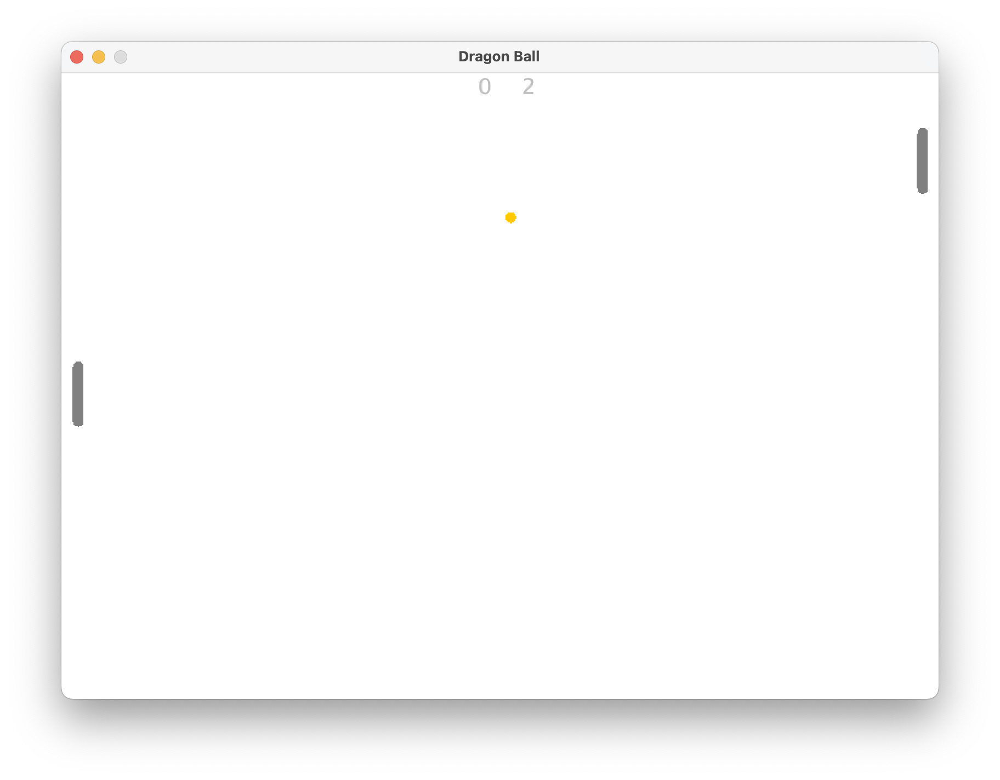

## Dragon Ball - pong game in JAVA

- pong game in java with java built-in libraries and packages.

## Table of Content


- [Demo](#demo)
- [Folder Structure](#folder-structure)
- [Libraries and Frameworks](#libraries-and-frameworks)
- [Setup and Run](#setup-and-run)
- [How to Play](#how-to-play)

## Demo



## Folder Structure

```
Project
.
├── README.md
├── demo
│   └── gamePlay.png
└── src
    ├── AiController.java
    ├── BallController.java
    ├── Constants.java
    ├── KeyEventListener.java
    ├── Main.java
    ├── MainMenu.java
    ├── MouseEventListener.java
    ├── PlayerController.java
    ├── Shape.java
    ├── TextHelper.java
    ├── Time.java
    └── Window.java

2 directories, 14 files

```

## Libraries and Frameworks

| Name   | Description                                                                                                        |
| ------ | ------------------------------------------------------------------------------------------------------------------ |
| Java   | Java is a widely used object-oriented programming language and software platform that runs on billions of devices. |
| Jframe | JFrame is a top-level container that provides a window on the screen.                                              |

## Setup and Run

```bash
$ cd src

# Linux / MacOS
$ find -name "*.java" > ../sources.txt

:: Windows
> dir /s /B *.java > ../sources.txt

$ cd ..
$ javac -d dist @sources.txt

$ java dist/Main
```

## How to Play

> press `up arrow key` or `w key` to go up and press `down arrow key` or `s key` to go down;  
> 
> press `esc key` (escape) or `space bar` to exit game;
